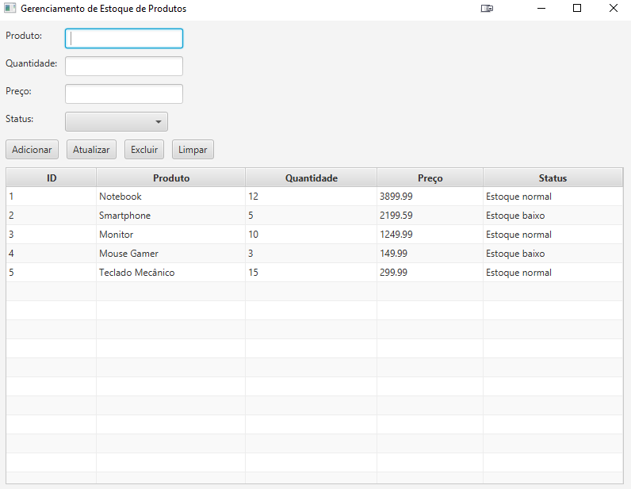

# Gerenciador de Estoque (Java CRUD)

Uma aplicação desktop para gestão de inventário, desenvolvida em Java. O projeto utiliza **JavaFX** para a interface gráfica e **SQLite** para persistência de dados, seguindo rigorosamente o padrão de projeto **DAO (Data Access Object)**.

## Funcionalidades

* **CRUD Completo:** Cadastro, consulta, atualização e exclusão de produtos em tempo real.
* **Interface Gráfica (GUI):** Interface moderna construída com JavaFX, incluindo TableView interativa e formulários de validação.
* **Banco de Dados Local:** Persistência utilizando SQLite, o que dispensa a configuração de servidores externos.
* **Arquitetura Organizada:** Separação clara de responsabilidades entre conexão, persistência, lógica de negócio e interface.

## Tecnologias Utilizadas

* **Linguagem:** Java 17+ 
* 
* **Interface Gráfica:** [JavaFX](https://openjfx.io/)
* 
* **Banco de Dados:** [SQLite](https://www.sqlite.org/)
* 
* **Conectividade:** JDBC (Java Database Connectivity)
* 

## Conceitos Aplicados

* Programação Orientada a Objetos (POO)
* DAO (Data Access Object)
* JDBC
* JavaFX
* Manipulação de banco de dados
* Collections
* Tratamento de exceções
* Arquitetura em camadas

## Estrutura de Pacotes

- `main.conexao`: Centraliza a lógica de conexão com o banco de dados.
- `main.Protutos`: Contém a entidade `Produto` e a classe `ProdutoDAO` (Data Access Object).
- `main.produtoGUI`: Implementação da interface visual e eventos de controlo.
- `main.tabela`: Script de inicialização para criação automática das tabelas.

## Como Executar o Projeto

### 1. Pré-requisitos
* Instalar o JDK 17 ou superior.
* Configurar as bibliotecas do JavaFX no seu ambiente de desenvolvimento (IDE).
* Caso utilize Java 11+, será necessário adicionar o SDK do JavaFX ao projeto. Exemplo de VM Options: (--module-path "CAMINHO_DO_JAVAFX/lib" --add-modules javafx.controls,javafx.fxml)
* Adicionar o driver JDBC do SQLite ao seu classpath.

### 2. Configuração do Banco de Dados

Antes de iniciar a interface, é necessário criar a estrutura da tabela:
1. Execute a classe `main.tabela.CriadorTabela`.
2. O arquivo `meu_banco_de_dados.db` será gerado automaticamente na raiz do projeto.

### 3. Execução
* **Interface Gráfica:** Execute a classe `main.produtoGUI.ProdutoGUI` para iniciar o gestor visual.
* **Modo de Teste (Console):** Execute a classe `main.main.Main` para validar as operações CRUD via terminal.

##  Autor

Thiemeleci Isaque - Desenvolvedor Backend Java.
* GitHub: https://github.com/Thiemeleci
* LinkedIn: https://www.linkedin.com/in/thiemeleci-isaque-059116243/

* **

Projeto desenvolvido como exemplo de boas práticas em Java Desktop e manipulação de SQL.
